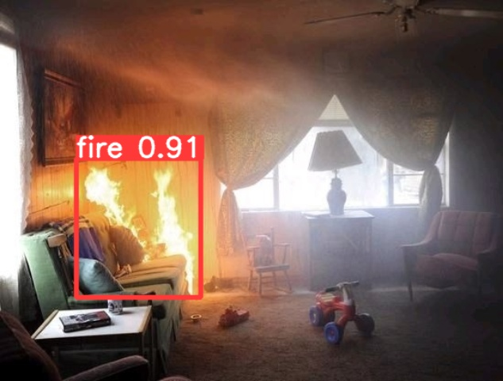

# YOLOv5 火灾检测系统

基于 YOLOv5 的实时火灾检测系统，集成 PyQt5 图形化操作界面，支持摄像头实时检测、视频文件检测和图片检测，并具备火灾报警功能。

## 痛点与目的

- **问题**：传统消防监控依赖人眼盯视频画面，7×24 小时值守不现实，火情发现滞后导致损失扩大
- **方案**：用 YOLOv5 训练火焰检测模型，接入摄像头或视频源自动识别火灾，检测到火焰立刻报警提醒
- **效果**：PyQt5 图形界面一键操作，支持摄像头实时流、视频文件和图片三种检测模式，发现火情自动播放报警音效

## 核心功能

- **实时摄像头检测**：调用本地摄像头实时进行火灾检测
- **视频文件检测**：对录制的监控视频进行逐帧火灾识别
- **图片检测**：对单张图片进行火灾区域标注与识别
- **PyQt5 图形界面**：友好的可视化操作窗口，支持一键切换检测模式
- **火灾报警提示**：检测到火灾时自动播放报警音效
- **YOLOv5 模型训练**：提供完整的模型训练流程，支持自定义数据集训练

## 技术架构

```
输入源（摄像头 / 视频 / 图片）
    ↓
PyQt5 图形界面（window.py）
    ↓
YOLOv5 推理引擎（detect + 预训练权重）
    ↓
NMS 后处理 + 目标框绘制
    ↓
实时显示检测结果 + 火灾报警
```

## 使用说明

### 环境安装

```bash
pip install -r yolov5-fire-42-master/requirements.txt
pip install PyQt5
```

### 启动图形界面

```bash
python window.py
```

### 训练自定义模型

```bash
cd yolov5-fire-42-master
python train.py --img 640 --batch 16 --epochs 100 --data data/fire.yaml --weights yolov5s.pt
```

## 项目结构

```
.
├── window.py                     # PyQt5 图形化检测界面（主程序）
├── fire_alert.wav.wav            # 火灾报警音效
└── yolov5-fire-42-master/        # YOLOv5 核心代码
    ├── train.py                  # 模型训练
    ├── detect.py                 # 推理检测
    ├── val.py                    # 模型验证
    ├── export.py                 # 模型导出
    ├── models/                   # 网络结构定义
    ├── utils/                    # 工具函数
    ├── data/                     # 数据集配置
    ├── pretrained/               # 预训练权重
    └── requirements.txt          # 依赖列表
```

## 检测效果展示

### 图片检测结果



### 视频帧检测结果


## 适用场景

- 智慧消防与火灾预警
- 工业厂房安全监控
- 森林防火巡检
- 视频监控智能分析

## 技术栈

| 组件 | 技术 |
|------|------|
| 目标检测 | YOLOv5 |
| 图形界面 | PyQt5 |
| 深度学习 | PyTorch |
| 图像处理 | OpenCV |
| 报警音效 | WAV 音频播放 |

## License

GPL-3.0 License
